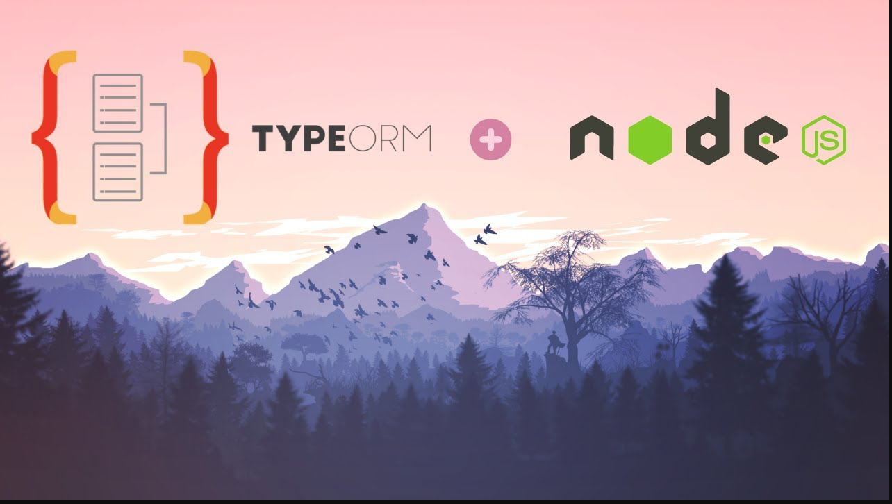
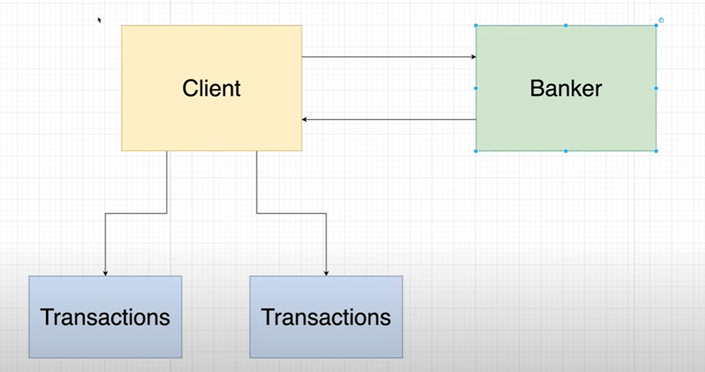
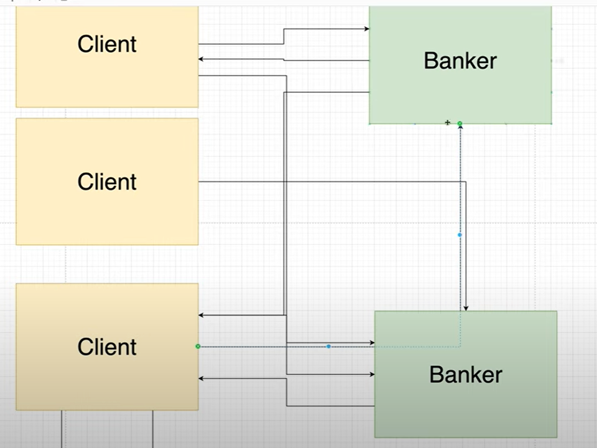

# TypeORM Crash Course - TypeScript & Node ORM

https://www.youtube.com/watch?v=JaTbzPcyiOE

TypeORM is a great node ORM that allows you to create tables and perform CRUD operations with TypeScript & JavaScript. You can use it with multiple databases like MySQL, Postgres or MongoDB.

**Project** --> BackEnd service for client banker transaction app 
**Channel** --> Laith Academy 63,4 mil inscritos 
**Date Created** --> 82.903 visualizações 10 de jul. de 2021

### Git Commands

npm init -y
npm i express @types/express pg ts-node typeorm typescript
npm install nodemon -g

### Observations

### Components

## TimeStamps:

0:00 - Intro 
5:35 - Setup 
8:30 - Connecting to the DB 
22:06 - Entities 
43:45 - Relationships 
1:01:30 - Inserting Data 
1:15:15 - Forming Relationships 
1:34:49 - Deleting Data 
1:43:10 - Fetching Data

